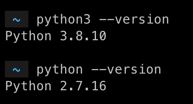
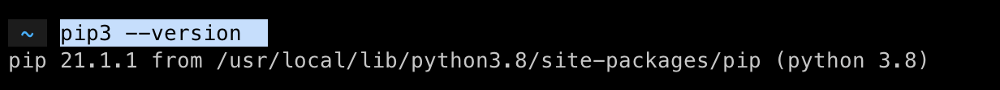

# Getting Started
```
Author          : Hrishikesh Shetgaokar
Guide           : Prof. Avinash Deshpande
Collaborators   : Akhil Jaini, Pavan Uttarkar, Yash Bhusare

This repository is being developed to help undergrad students participating in SWAN get familiarised with radio data processing techniques.

Feel free to reach out to hrishikesh036@gmail.com
```

## Table of Contents
1. [Python Installation](#1-python-installation)
2. [pip](#2-pip)


## 1. Python Installation

1. First check if python is already installed. In your terminal (command prompt), type ‘python --version’ and ‘python3 --version’. If python is installed, it’ll show the version. If not installed, then you’ll get an error saying “command not found”. For our sessions, we'll be using python3.

<p align="center">
  
</p>
<p align="center">
  <a>Figure 1.1: Checking if python is installed</a>
  <br><br>
</p>

2. If you don't have python installed, you’ll get everything you need to know: https://www.python.org/downloads/<br>
* For macOs and Windows, the installation is pretty simple.  You just download the installer and run through the steps.<br>
* For Ubuntu(16.10 or newer), you can follow the steps mentioned in this post: https://docs.python-guide.org/starting/install3/linux/.<br>
* If you are using any other OS or facing some issue, feel free to reach out.

## 2. pip
1. *pip* is a package manager used for python. It simplifies the task of installing packages like numpy, astropy, etc. When you have installed python, you should also get *pip*. To check if you have pip, just run `pip --version` or `pip3 --version` in the terminal.
<p align="center">
  
</p>
<p align="center">
  <a>Figure 2.1: Checking if pip is installed</a>
  <br><br>
</p>