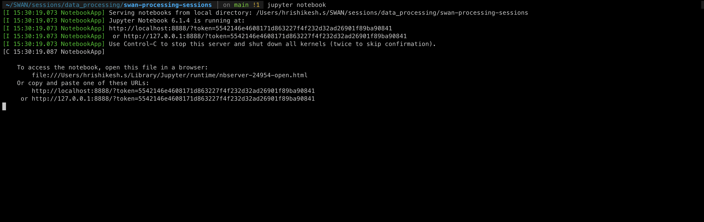
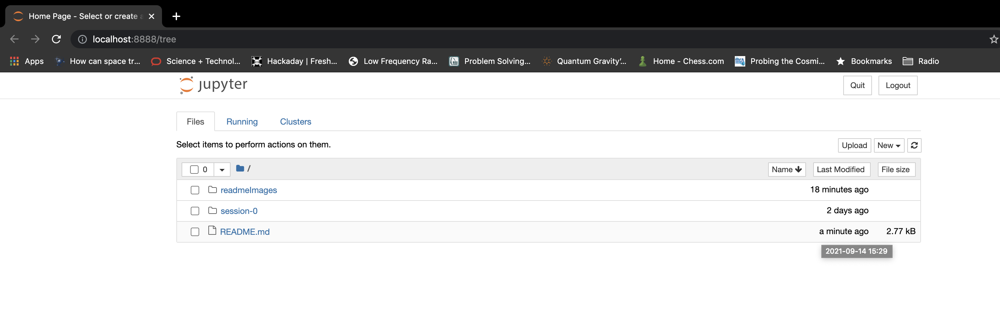
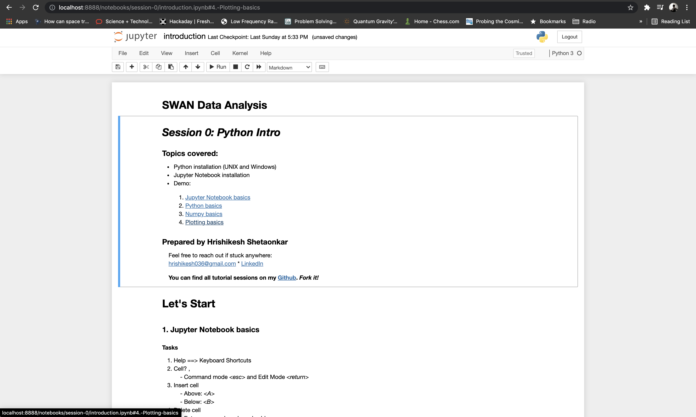
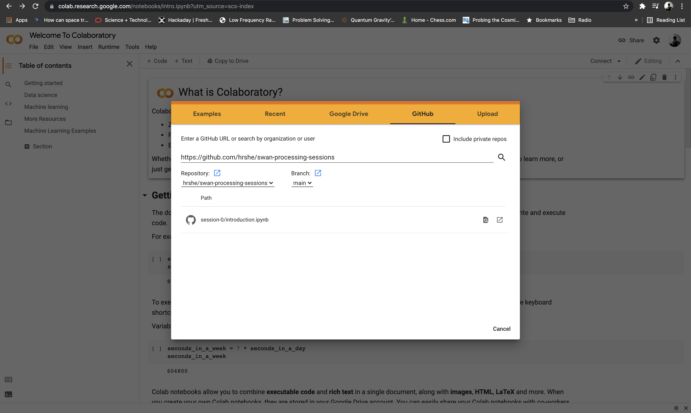
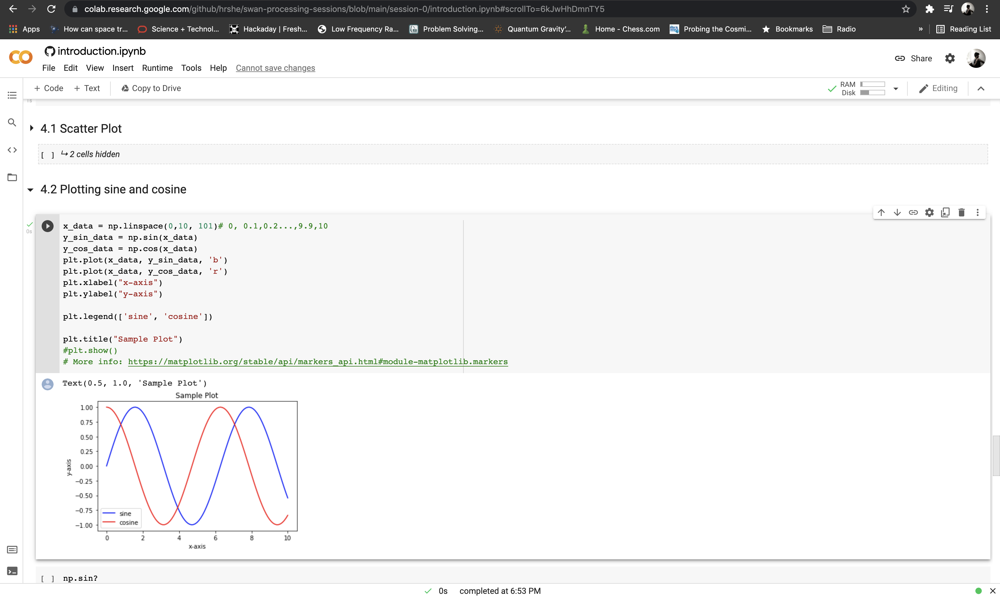

# Getting Started
```
Author          : Hrishikesh Shetgaokar
Guide           : Prof. Avinash Deshpande
Collaborators   : Akhil Jaini, Pavan Uttarkar, Yash Bhusare

This repository is being developed to help undergrad students participating in SWAN get familiarised with radio data processing techniques.

Feel free to reach out to hrishikesh036@gmail.com
```

## Table of Contents
1. [Python Installation](#1-python-installation)
2. [pip](#2-pip)
3. [Jupyter Notebook Installation](#3-jupyter-notebook-installation)
3. [Google Colab](#3-google-colab)

## 1. Python Installation

1. First check if python is already installed. In your terminal (command prompt), type `python --version` and `python3 --version`. If python is installed, it’ll show the version. If not installed, then you’ll get an error saying “command not found”. For our sessions, we'll be using python3.

<p align="center">
  
</p>
<p align="center">
  <a>Figure 1.1: Checking if python is installed</a>
  <br><br>
</p>

2. If you don't have python installed, you’ll get everything you need to know: <br>https://www.python.org/downloads/<br>
* For macOs and Windows, the installation is pretty simple.  You just download the installer and run through the steps.<br>
* For Ubuntu(16.10 or newer), you can follow the steps mentioned in this post: <br>https://docs.python-guide.org/starting/install3/linux/.<br>
* If you are using any other OS or facing some issue, feel free to reach out.

## 2. pip
1. *pip* is a package manager used for python. It simplifies the task of installing packages like numpy, astropy, etc. When you have installed python, you should also get *pip*. To check if you have pip, just run `pip --version` or `pip3 --version` in the terminal.
<p align="center">
  
</p>
<p align="center">
  <a>Figure 2.1: Checking if pip is installed</a>
  <br><br>
</p>

2. If this gives an error, go to the directory where python is installed. Then go to *bin* directory there. A sample path to one such *bin* directory can be: *"/usr/local/opt/python@3.8/bin"*. Check if there is a file named `pip` or `pip3`. If yes, you'll need to set PATH environment variable.

3. If you don’t have pip, some resources for installation:<br>
https://stackoverflow.com/a/12476379<br>
https://www.geeksforgeeks.org/how-to-install-pip-on-windows/<br>
https://pip.pypa.io/en/stable/installation/

## 2. Jupyter Notebook Installation
1. Once you have pip, you can now easily install jupyter notebook.
Just run `pip install notebook`. More info here: <br>https://jupyter.org/install.html<br>
2. To run the notebook, go to the directory where you want to start a project and run the following command on the terminal (or command prompt): `jupyter notebook`. On successfull startup, you'll see the following:
<p align="center">
  
</p>
<p align="center">
  <a>Figure 2.1: Jupyter Notebook startup logs seen in terminal</a>
  <br><br>
</p>

<p align="center">
  
</p>
<p align="center">
  <a>Figure 2.2: Jupyter Notebook startup page</a>
  <br><br>
</p>

Once you see the Jupyter notebook startup page, just browse to the project file location and open the project.

<p align="center">
  
</p>
<p align="center">
  <a>Figure 2.3: Jupyter project</a>
  <br><br>
</p>

You are ready to go... Start exploring!

## 3. Google Colab
You can also open the python notebooks on Google Colab:
<p align="center">
  
</p>
<p align="center">
  <a>Figure 3.1: Google Colab Setup</a>
  <br><br>
</p>

1. Visit Google Colab: https://colab.research.google.com/
2. File &#8594; Open Notebook &#8594; GitHub
3. Enter GitHub url: https://github.com/hrshe/swan-processing-sessions and click on search (&#x1F50D; icon)
4. In Repository, select `hrshe/swan-processing-sessions`. Select `main` branch.
5. `session-0/introduction.ipynb` will now be listed. Open the project by clicking on it. You can now edit and run the cells! You might also want to add the notebook to your Google Drive. 
<p align="center">
  
</p>
<p align="center">
  <a>Figure 3.1: Google Colab Notebook</a>
  <br><br>
</p>

6. In our excercises, we'll be using some data files. For example, in Sec. 4.4 of `session-0/introduction.ipynb`, you'll need `simulated_pulse.image` data file. First download these data files from [GitHub repository](https://github.com/hrshe/swan-processing-sessions). 
7. In your Google Colab, click on the <i class="far fa-folder"></i> folder icon.

